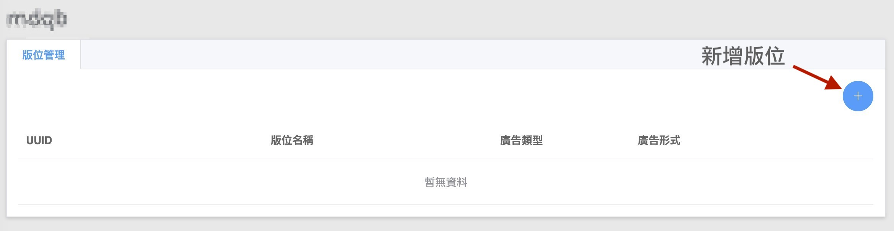

# 🎉 Ad Slot Management

## \[Release Note] Ad Slot Management for Publishers 

#### Hello 各位開發者 

在此通知大家，**AotterTrek** 的**全新版位管理系統**已經上線囉～🎉

下面會為您說明如何使用新管理系統，請不用擔心，使用此系統**不需要更新 Trek SDK 版本**

您只需要注意**系統版位名稱**以及您**應用程式中廣告請求的版位名稱(place name) 是否一致**即可。

此說明會將重點放在以下兩點：

1. 如何**新增廣告版位**
2. 如何**管理現有的廣告版位**

**1. 新增廣告版位**

首先請您登入 [**AotterTrek Dashboard**](https://trek.aotter.net/me) -> 點選左側爛中數據工具內的"**應用程式列表**"

進入列表後，您會發現在廣告開通狀態欄中多了**版位管理** (僅限已開通狀態)。

點擊進入後，您可以點選右上角的 ✚ **新增版位** ，並填入版位名稱、類型、大小

我們分別提供了**三種廣告類型**以符合您的各種需求：**Supr.Ad**、**原生廣告**、**橫幅廣告**

|  |  |
| -------------------------------------- | ---------------------------------------------- |


✨ **** 需要您特別注意的是 :\
1\. **廣告版位名稱可使用 a - z, 0 - 9,  \_**，**請勿使用中文名稱。**\
****2. **** 廣告請求時需帶入**版位** **UUID**，目前已不需要帶入版位名稱。\
3\. 切換正式 / 測試環境只需要更換 client Id 即可。


**2. 管理現有廣告版位**

您可能會問：『現有的版位？我還沒使用怎麼系統上就有版位了？』

因為我們已經根據您請求廣告時的**版位名稱**以及**廣告類型**，提前先幫您建置好了🤓

進入版位管理後，您會表格中看到您目前的**版位名稱、廣告類型、廣告形式**。

如果您有建立新廣告版位的需求，一樣可以點選右上角的 ✚ 新增版位。

