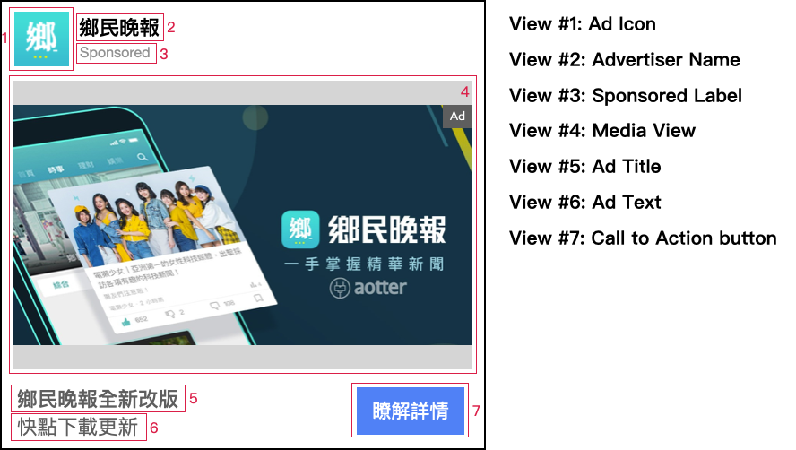

# Native Ad

## Add Native Ads to an Android APP

The Native Ad API allows you to build a customized experience for the ads you show in your app. When using Native Ad API, instead of receiving an ad ready to be displayed, you will receive a group of **ad parameters** such as a title, an image, a call to action, and you are able to use them to construct a custom view where the ad is shown.\
\
****Follow these steps to build a native ad layout that fits your application and then requests it.\
****

Step 1: [Create Ad Layout](native-ad.md#step-1-create-treknativeadview)\
Step 2: [How to build and request ad](native-ad.md#step-2-how-to-build-and-request-ad) \
Step 3: [Render ad  layout](native-ad.md#step-3-render-treknativeadview-layout)

### TrekNativeAd Parameters

| Variable         | Type   | Description     |  **Always have value** |  Required to be displayed |
| ---------------- | ------ | --------------- | ---------------------- | ------------------------- |
| `advertiserName` | String | Advertiser Name | Yes                    | Recommended               |
| `title`          | String | Ad Headline     | Yes                    | Required                  |
| `text`           | String | Ad Text         | No, could be empty     | Recommended               |
| `imgMain`        | String | Size: 1200x628  | Yes                    | Recommended               |
| `imgIcon`        | String | Size: 82x82     | Yes                    | Recommended               |
| `imgIconHd`      | String | Size: 300x300   | Yes                    | Recommended               |
| `callToAction`   | String | Ex: "瞭解詳情"      | Yes                    | Recommended               |
| `sponsor`        | String | Sponsored       | Yes                    | Required                  |



#### - isExpired

You can use this method to check if the ad is expired or not.



```kotlin
trekNativeAd.isExpired()
```



```java
trekNativeAd.isExpired();
```



### Step 1: Create Ad Layout

Create NativeAdView or you can check out the example layout below.

```xml
<androidx.constraintlayout.widget.ConstraintLayout
                android:id="@+id/adContainer"
                android:layout_width="match_parent"
                android:layout_height="match_parent">

                <com.aotter.net.trek.ads.TrekMediaView
                    android:id="@+id/trekMediaView"
                    android:layout_width="match_parent"
                    android:layout_height="wrap_content"
                    app:layout_constraintEnd_toEndOf="parent"
                    app:layout_constraintStart_toStartOf="parent"
                    app:layout_constraintTop_toTopOf="parent" />

                <TextView
                    android:id="@+id/advertiser"
                    android:layout_width="0dp"
                    android:layout_height="wrap_content"
                    android:layout_marginStart="8dp"
                    android:layout_marginEnd="8dp"
                    android:text="Sponsored"
                    android:textColor="@android:color/holo_red_dark"
                    android:textSize="18sp"
                    android:textStyle="bold"
                    app:layout_constraintEnd_toEndOf="parent"
                    app:layout_constraintStart_toStartOf="parent"
                    app:layout_constraintTop_toBottomOf="@+id/trekMediaView" />

                <TextView
                    android:id="@+id/adTitle"
                    android:layout_width="0dp"
                    android:layout_height="wrap_content"
                    android:layout_marginTop="8dp"
                    android:layout_marginEnd="8dp"
                    android:text="TextView"
                    android:textSize="14sp"
                    android:textStyle="bold"
                    app:layout_constraintEnd_toEndOf="parent"
                    app:layout_constraintStart_toStartOf="@+id/advertiser"
                    app:layout_constraintTop_toBottomOf="@+id/advertiser" />

</androidx.constraintlayout.widget.ConstraintLayout>
```

### Step 2: How to build and request ad&#x20;

**Create TrekAdListener**



```kotlin
private val trekAdListener = object : TrekAdListener {
        override fun onAdFailedToLoad(message: String) {
            super.onAdFailedToLoad(message)
            //ad error
        }

        override fun onAdLoaded(trekNativeAd: TrekNativeAd) {
            super.onAdLoaded(trekNativeAd)
            //sueecss get an ad data
            //trekNativeAd is an ad data.
        }

        override fun onAdClicked() {
            super.onAdClicked()

            //ad was clicked.
            
        }

        override fun onAdImpression() {
            super.onAdImpression()
            
            //ad has been displayed.

        }
    }
```



```java
private TrekAdListener trekAdListener = new TrekAdListener(){

        @Override
        public void onAdImpression() {
                //ad has been displayed.
        }

        @Override
        public void onAdClicked() {
                //ad was clicked.
        }

        @Override
        public void onAdLoaded(@NonNull TrekNativeAd trekNativeAd) {
             //sueecss get an ad data
            //trekNativeAd is an ad data.
        }

        @Override
        public void onAdFailedToLoad(@NonNull String message) {
              //ad error  
        }
    };
```



**Create TrekAdLoader**



```kotlin
val trekAdLoader = TrekAdLoader
            .Builder(context, "YOUR_UUID")//Ex."0000-12345-6789-000"
            .withAdListener(trekAdListener)
            .build()
```



```java
TrekAdLoader trekAdLoader = new TrekAdLoader
            .Builder(context, "YOUR_UUID")//Ex."0000-12345-6789-000"
            .withAdListener(trekAdListener)
            .build()
```



**Create TrekAdRequest**



```kotlin
val trekAdRequest = TrekAdRequest
            .Builder()
            //The setCategory()、setContentUrl()、setContentTitle() method is optional. You can skip it if you don't want to set it.
            .setCategory("YOUR_CATEGORY_STRING_WHICH_YOU_WANT")//Ex."news"
            .setContentUrl("YOUR_CONTENT_URL_STRING_WHICH_YOU_WANT")//Ex."https://agirls.aotter.net/"
            .setContentTitle("YOUR_CONTENT_TITLE_WHICH_YOU_WANT")//Ex."電獺少女"
            .build()
```



```java
TrekAdRequest trekAdRequest = new TrekAdRequest
            .Builder()
            //The setCategory()、setContentUrl()、setContentTitle() method is optional. You can skip it if you don't want to set it.
            .setCategory("YOUR_CATEGORY_STRING_WHICH_YOU_WANT")//Ex."news"
            .setContentUrl("YOUR_CONTENT_URL_STRING_WHICH_YOU_WANT")//Ex."https://agirls.aotter.net/"
            .setContentTitle("YOUR_CONTENT_TITLE_WHICH_YOU_WANT")//Ex."電獺少女"
            .build();
```



**Load ad**



```kotlin
trekAdLoader.loadAd(trekAdRequest)
```



```java
trekAdLoader.loadAd(trekAdRequest);
```



### Step 3: Render ad  layout



```kotlin
override fun onAdLoaded(trekNativeAd: TrekNativeAd) {
   super.onAdLoaded(trekNativeAd)
            
    val advertiserName:String = trekNativeAd.advertiserName

    val title:String = trekNativeAd.title
    
    val text:String = trekNativeAd.text
    
    var imgIconHdUri:Uri = trekNativeAd.imgIconHd.uri //size:300x300

    var imgMainUri:Uri = trekNativeAd.imgMain.uri //size:1200x628
    
    var imgIconUri:Uri = trekNativeAd.imgIcon.uri //size:82x82

    var imgIconHdDrawable:Drawable = trekNativeAd.imgIconHd.drawable//size:300x300

    var imgMainDrawable:Drawable = trekNativeAd.imgMain.drawable//size:1200x628
    
    var imgIconDrawable:Drawable = trekNativeAd.imgIcon.drawable//size:82x82
    
    val callToAction:String = trekNativeAd.callToAction
    
    val sponsor:String = trekNativeAd.sponsor
    
    //Registered ad 
 TrekAdViewBinder.registerAdView(viewBinding.adContainer,viewBinding.trekMediaView,trekNativeAd)
}
```



```java
@Override
public void onAdLoaded(@NonNull TrekNativeAd trekNativeAd) {

    String advertiserName = trekNativeAd.advertiserName;

    String title = trekNativeAd.title;
    
    String text = trekNativeAd.text;
    
    Uri imgMainUri = trekNativeAd.getImgMain().getUri(); //size:1200x628

    Uri imgIconUri = trekNativeAd.getImgIcon().getUri(); //size:82x82

    Uri imgIconHdUri = trekNativeAd.getImgIconHd().getUri(); //size:300x300
      
    Drawable imgMainDrawable = trekNativeAd.getImgMain().getDrawable(); //size:1200x628

    Drawable imgIconDrawable = trekNativeAd.getImgIcon().getDrawable(); //size:82x82

    Drawable imgIconHdDrawable = trekNativeAd.getImgIconHd().getDrawable(); //size:300x300

    String callToAction = trekNativeAd.callToAction;
    
    String sponsor = trekNativeAd.sponsor;
    
      //Registered ad 
 TrekAdViewBinder.registerAdView(viewBinding.adContainer,viewBinding.trekMediaView,trekNativeAd)
    
}
```


