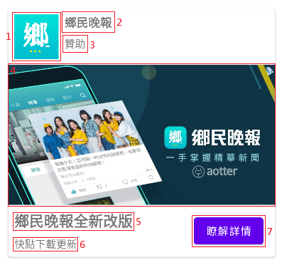

# Display an ad

When a native ad loads, the Trek Ads SDK invokes the listener for the corresponding ad format. Your app is then responsible for displaying the ad. To make displaying system-defined ad formats easier, the SDK offers some useful resources, as described below.

Implementing native ads in your app following steps:

* ****[**Setting ad layout**](display-an-ad.md#setting-ad-layout)****
* ****[**Populating the asset view with the asset in the ad object**](display-an-ad.md#populating-the-asset-view-with-the-asset-in-the-ad-object)****
* ****[**Register TrekMediaView and TrekNativeAd**](display-an-ad.md#register-trekmediaview-and-treknativead)****
* ****[**Destroy ad**](display-an-ad.md#destroy-ad)****

### **Setting ad layout**

Here is an example layout style:

<figure><figcaption><p>Example layout style</p></figcaption></figure>

| View | TrekNativeAd asset                    |
| ---- | ------------------------------------- |
| #1   | trekNativeAd.icon、trekNativeAd.iconHd |
| #2   | trekNativeAd.advertiserName           |
| #3   | trekNativeAd.sponsored                |
| #4   | trekMediaView                         |
| #5   | trekNativeAd.title                    |
| #6   | trekNativeAd.text                     |
| #7   | trekNativeAd.callToAction             |

* #### Optional 1 :  uses a[**`TrekNativeAdView`** layout](display-an-ad.md#recommend-treknativeadview-layout)
* #### **O**ptional 2 : uses a [custom layout](display-an-ad.md#custom-layout)

<details>

<summary><a href="display-an-ad.md#treknativeadview-class"> </a>(Recommend) TrekNativeAdView layout </summary>

```xml
<com.aotter.net.trek.ads.TrekNativeAdView
    xmlns:android="http://schemas.android.com/apk/res/android"
    xmlns:app="http://schemas.android.com/apk/res-auto"
    android:id="@+id/trekNativeAdView"
    android:layout_width="match_parent"
    android:layout_height="wrap_content">

    <TextView
        android:id="@+id/advertiser"/>
        
    <TextView
        android:id="@+id/adTitle"/>

    <TextView
        android:id="@+id/adText"/>

    <ImageView
        android:id="@+id/adMainImg" />
        
    <ImageView
        android:id="@+id/adIcon" />
        
  // Other assets such as sponsor or media view, call to action, etc follow.

</com.aotter.net.trek.ads.TrekNativeAdView>
```

</details>

<details>

<summary>Custom layout</summary>

```xml
<androidx.constraintlayout.widget.ConstraintLayout
    xmlns:android="http://schemas.android.com/apk/res/android"
    xmlns:app="http://schemas.android.com/apk/res-auto"
    android:id="@+id/trekNativeAdView"
    android:layout_width="match_parent"
    android:layout_height="wrap_content">

    <TextView
        android:id="@+id/advertiser"/>
        
    <TextView
        android:id="@+id/adTitle"/>

    <TextView
        android:id="@+id/adText"/>

    <ImageView
        android:id="@+id/adMainImg" />
        
    <ImageView
        android:id="@+id/adIcon" />
        
  // Other assets such as sponsor or media view, call to action, etc follow.

</androidx.constraintlayout.widget.ConstraintLayout>
```

</details>

### **Populating the asset view with the asset in the ad object**

Here is an example function that displays a **`TrekNativeAd`**:



```kotlin
private fun displayAd(trekNativeAd: TrekNativeAd) {

    advertiser.text = trekNativeAd.advertiserName

    adText.text = trekNativeAd.text

    adTitle.text = trekNativeAd.title
    
    adMainImg.background = trekNativeAd.imgMain.drawable
    
    adIcon.background = trekNativeAd.imgIcon.drawable
    
    callToAction.text = trekNativeAd.callToAction

    ...
    // Repeat the above process for the other assets in the TrekNativeAd using
    // additional view objects (Buttons, ImageViews, etc).
    ...

}
```



```java
private void displayAd(TrekNativeAd trekNativeAd) {

    advertiser.setText(trekNativeAd.advertiserName);

    adText.setText(trekNativeAd.text);

    adTitle.setText(trekNativeAd.title);
    
    adMainImg.setBackground(trekNativeAd.imgIcon.drawable);
    
    adIcon.setBackground(trekNativeAd.imgIcon.drawable);
    
    callToAction.setText(trekNativeAd.callToAction);
    
    ...
    // Repeat the above process for the other assets in the TrekNativeAd using
    // additional view objects (Buttons, ImageViews, etc).
    ...

}
```



### Register TrekMediaView and TrekNativeAd

This final step registers the TrekNativeAd object with the view that's responsible for displaying it:



* TrekNativeAdView layout

```kotlin

//if you don't want set TrekMediaView ,please skip it.
trekNativeAdView.setTrekMediaView(trekMediaView)

//Registering the views in this way allows the SDK to automatically handle tasks such as:
//Recording clicks
//Recording impressions
trekNativeAdView.setNativeAd(trekNativeAd)

```

* Custom layout

```kotlin

//create a viewStateTracker object.
val viewStateTracker = TrekAdViewUtils.createViewStateTracker(trekNativeAd)

// add Friendly Obstruction view
//we recommend add all child view of your ad view to friendly obstruction method,it can increase impression rate.
//If there are any native elements which you would consider to be part of the ad, such as a close button, some logo text, or another decoration, you should register them as friendly obstructions to prevent them from counting towards coverage of the ad. This applies to any ancestor or peer views in the view hierarchy (all sub-views of the adView will be automatically treated as part of the ad)
viewStateTracker.addFriendlyObstruction(view)//child view1
viewStateTracker.addFriendlyObstruction(view)//child view2
viewStateTracker.addFriendlyObstruction(view)//child view3

//containerView is your custom layout.
//if you don't want inject TrekMediaView ,please inject null.
//Registering the views in this way allows the SDK to automatically handle tasks such as:
//Recording clicks
//Recording impressions
viewStateTracker.launchViewStateTracker(containerView , trekMediaView)
```



* TrekNativeAdView layout

```java

//if you don't want set TrekMediaView ,please skip it.
trekNativeAdView.setTrekMediaView(trekMediaView);

//Registering the views in this way allows the SDK to automatically handle tasks such as:
//Recording clicks
//Recording impressions
trekNativeAdView.setNativeAd(trekNativeAd);

```

* Custom layout

```java

//create a viewStateTracker object.
ViewStateTracker  viewStateTracker = TrekAdViewUtils.createViewStateTracker(trekNativeAd);

// add Friendly Obstruction view
// we recommend add all child view of your custom layout to friendly obstruction method,it can increase impression rate.
// If there are any native elements which you would consider to be part of the ad, such as a close button, some logo text, or another decoration, you should register them as friendly obstructions to prevent them from counting towards coverage of the ad. This applies to any ancestor or peer views in the view hierarchy (all sub-views of the adView will be automatically treated as part of the ad)
viewStateTracker.addFriendlyObstruction(view);//child view1
viewStateTracker.addFriendlyObstruction(view);//child view2
viewStateTracker.addFriendlyObstruction(view);//child view3

//containerView is your custom layout.
//if you don't want inject TrekMediaView ,please inject null.
//Registering the views in this way allows the SDK to automatically handle tasks such as:
//Recording clicks
//Recording impressions
viewStateTracker.launchViewStateTracker(containerView , trekMediaView);
```



### Destroy ad



* TrekNativeAdView layout

```kotlin
trekNativeAdView.destroy()
```

* Custom layout

```kotlin
TrekAdViewUtils.destroyAd(trekNativeAd)
```



* TrekNativeAdView layout

```java
trekNativeAdView.destroy();
```

* Custom layout

```java
TrekAdViewUtils.destroyAd(trekNativeAd);
```


