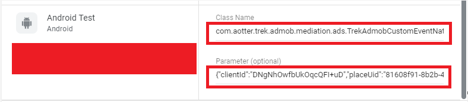

# Prerequisites

AdMob Mediation is a feature that lets you serve ads to your apps from multiple sources, including the AdMob Network and third-party ad networks. This guide will show you how to integrate AotterTrek Network into your app.

Before you can integrate mediation that **AotterTrek Network as a third-party ad network** for an ad format, you need to integrate that ad format into your app:

* ****[**AdMob Native Ads**](https://developers.google.com/admob/android/native/start)****
* ****[**AdMob Banner Ads**](https://developers.google.com/admob/android/banner)


If you don't familiar with AdMob, please refer to the links below:

* **New to Google AdMob?**&#x20;
  * **Read** [**Admob - Get Started**](https://developers.google.com/admob/android/quick-start)****
* **New to mediation?**&#x20;
  * **Read** [**AdMob mediation - Overview**](https://developers.google.com/admob/android/mediate)****
  * **Read** [**How to add custom events**](https://support.google.com/admob/answer/3083407?hl=zh-Hant\&ref\_topic=7383089)****


Prerequisites in AdMob console following steps:

* ****[**Configure AdMob Ad Units**](prerequisites.md#configure-admob-ad-units)****
* ****[**Always test with test ads**](prerequisites.md#always-test-with-test-ads)****

### Configure AdMob Ad Units

Add **`adUnit`** in your mediation group and fill in **`Class Name`**, **`Parameter`**.


**Key Point:**&#x20;

* Make sure use **Trek SuprAd  PlaceUid**.
* Make sure **`Class Name and Parameter`** no extra space characters.


<figure><figcaption>
<strong>AdMob</strong>
</figcaption></figure>

<table data-card-size="large" data-view="cards"><thead><tr><th>Ad formet</th><th>Class Name</th><th>Parameter</th><th data-type="select"></th></tr></thead><tbody><tr><td>Native Ads</td><td><strong>com.aotter.trek.admob.mediation.ads.TrekAdmobCustomEventNative</strong></td><td>{"clientId":"<strong>[Trek client id]</strong>","placeUid":"<strong>[Trek SuprAd PlaceUid]</strong>"}</td><td></td></tr><tr><td>Banner Ads</td><td><strong>com.aotter.trek.admob.mediation.ads.TrekAdmobCustomEventBanner</strong></td><td>{"clientId":"<strong>[Trek client id]</strong>","placeUid":"<strong>[Trek Banner Ad PlaceUid]</strong>"}</td><td></td></tr></tbody></table>

### **Always test with test ads**

The easiest way to load test ads is to use our test client id and test place uid for Native Advanced.


**Key Point:** Make sure you replace these client id and place uid with your own ad unit ID before publishing your app.


| Ad Format | Parameter                                                                             |
| --------- | ------------------------------------------------------------------------------------- |
| Native Ad | {"clientId":"DNgNhOwfbUkOqcQFI+uD","placeUid":"81608f91-8b2b-4f8f-86a1-539a1959f836"} |
| Banner Ad | {"clientId":"DNgNhOwfbUkOqcQFI+uD","placeUid":"68856f90-83b7-4f09-98d4-7f480842cb02"} |
