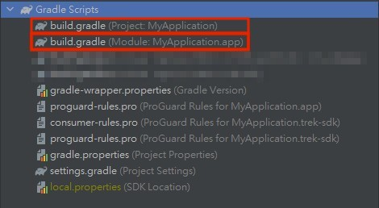

# Installation

Follow these steps to download and include SDK in your project:

**Step 1:** [**Including the SDK**](installation.md#including)****\
**Step 2:** [**Initialization**](installation.md#step-2-initialization)

### Step 1: Including the SDK <a href="#including" id="including"></a>


Please noticed that AotterTrek Android SDK Development Environment: `Kotlin version 1.6.21 up`


**Using Gradle**



Add the following dependencies to your **app-level** build.gradle (not project!), to use the latest AotterTrek SDK:


**In order to achieve better version integration and normalization, Aotter Trek adjusted the `dependency path` and `mediation class name path`.**\
****[**See Change Log**](../changelog.md)



**We are about to deprecated versions prior to 4.4.5.**

**Recommend developer install above version 4.7.2.**


**Before version 4.4.5 ,please refer to the following.**

```groovy
dependencies {

implementation 'com.aotter.net:trek-sdk-android-kotlin:4.4.5'

}
```

**Above version 4.7.2 ,please refer to the following.**

```groovy
dependencies {

implementation 'com.aotter.android:trek-ads:4.7.2'

}
```

Please add the following code snippet in your **project-level** build.gradle.

```groovy
allprojects {
    repositories {
        google()
        mavenCentral()
        
        // Add this 
        maven { url 'https://deps.aotter.net/artifactory/libs-release-local' }
        
    }
}
```

**AndroidManifest.XML**

Please add the following code snippet in your AndroidManifest.XML

```xml
<uses-permission android:name="com.google.android.gms.permission.AD_ID" />
```

### Step 2: Initialization

After including SDK in your project, you will also need to implement the following line of code to initialize SDK. If you have implemented extensions to the application class, it is recommended to initialize the AotterTrek service in `onCreate()` method. In the following example, the `context` variable represents an `Application` or `Activity`.\
\
Please use **your client id** for initialization which can be found in the [application list](https://trek.aotter.net/publisher/list/app).&#x20;



```kotlin
class MyApplication:Application {
    override fun onCreate(savedInstanceState: Bundle?) {
        super.onCreate(savedInstanceState)
        
        //Test client id: DNgNhOwfbUkOqcQFI+uD
        //In a real app, use your actual client id, not the one listed above.
        TrekAds.initialize(context,"DNgNhOwfbUkOqcQFI+uD"){
            //init finshed callback.
        }
                   
    }
}


```



```java
public class MyApplication extends Application {
    @Override
    public void onCreate() {
        super.onCreate();
       
        //Test client id: DNgNhOwfbUkOqcQFI+uD
        //In a real app, use your actual client id, not the one listed above.
        TrekAds.INSTANCE.initialize(this, "DNgNhOwfbUkOqcQFI+uD", () -> {

            //init finshed callback.

            return Unit.INSTANCE;

        });
        
    }
}
```



### Test ad units

We also provide test client id and test place id for receiving test ads only.


* Test Client ID **:**&#x20;
  * **DNgNhOwfbUkOqcQFI+uD**
* Test Place ID **:**&#x20;
  * Native Ad :&#x20;
    * **45419fb5-a846-4c4a-837f-3b391ec7b45a**
  * Supr.Ad :&#x20;
    * **81608f91-8b2b-4f8f-86a1-539a1959f836**
  * Banner Ad **:**&#x20;
    * **68856f90-83b7-4f09-98d4-7f480842cb02**


## Next Steps

* Follow our guides for integrating different Ad Formats in your app:
  * [Native Ad](../ad-formats/native-ad.md)
  * [Banner Ad](../ad-formats/banner-ad.md)
* Or you would like to check out the demo app:
  * [Demo](trek-example-app-demo.md)
