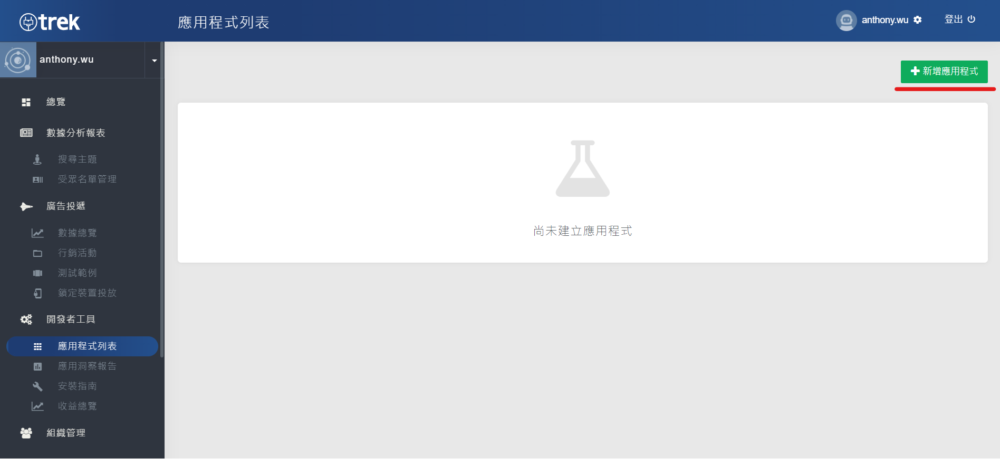

# Prerequisites

AotterTrek allows you to monetize your Android apps with ads. This prerequisites section will walk you through all necessary steps before integrating the SDK.

**Step 0:** [**Check SDK Version Restriction** ](prerequisites.md#step-0-check-sdk-version-restriction)****\
**Step 1:** [**Register AotterTrek Account**](prerequisites.md#step-1-register-aottertrek-account)****\
**Step 2:** [**Set Up New Application**](prerequisites.md#step-2-set-up-new-application)****\
**Step 3:** [**Create an Ad Slot**](prerequisites.md#step-3-create-an-ad-slot)

### **Step 0: Check SDK Version Restriction**

Noticed that our SDK version restriction is **minSdkVersion 21 or later**.

### **Step 1: Register AotterTrek Account**

Register for AotterTrek Account **** [**here**](https://trek.aotter.net)**.**

### **Step 2: Set up New Application**

Set up a new application in the application list.

After entering the list, you might find the ad status is test ad only. For the publisher who use AotterTrek SDK for the first time and didn't get full access to ad slots management, please contact Aseal representative or [E-mail us](https://aseal.in/contactus).

#### **When activated, there will be ad slot management in the right column as shown.** 

### **Step 3: Create an Ad Slot**

Entering the ad slots management and then creating ad slots. Name the ad slot with lowercase letters `a-z` , number `0-9` and underscore `_` .\
AotterTrek currently provides three types of ad and different sizes:

* Native Ad
* Supr.Ad (1200x628)
* Banner Ad (320x50)

After the ad slot is created, you will see a list of ad slots as shown.

## Next Steps

* Follow our guides for installation SDK


[installation.md](installation.md)


