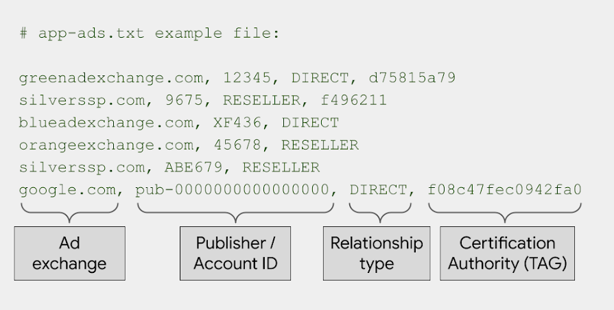

# app-ads.txt

## Implementing app-ads.txt in your app following steps:

#### **Step 1.**[**Overview**](app-ads.txt.md#overview)****

#### **Step 2.**[**Set up an app-ads.txt file for your app**](app-ads.txt.md#set-up-an-app-ads.txt-file-for-your-app)****

#### **Step 3.**[**Publish your app-ads.txt file on your developer website**](app-ads.txt.md#publish-your-app-ads.txt-file-on-your-developer-website)****

#### **Step 4.**[**Add your developer website in your app store listing**](app-ads.txt.md#add-your-developer-website-in-your-app-store-listing)****

## [Overview](app-ads.txt.md#step-1.overview)

[Authorized Sellers for Apps, or app-ads.txt](https://iabtechlab.com/wp-content/uploads/2019/03/app-ads.txt-v1.0-final-.pdf), is an IAB Tech Lab initiative that helps ensure your app ad inventory is only sold through channels you’ve identified as authorized. Creating an app-ads.txt file gives you more control over who’s allowed to sell ads on your app and helps prevent counterfeit inventory from being presented to advertisers.&#x20;

The app-ads.txt files are publicly available and crawlable by exchanges, supply-side platforms (SSP), and other buyers and third-party vendors.

Authorized Sellers for Apps (app-ads.txt) is an extension to the [Authorized Digital Sellers (ads.txt)](https://www.iabtechlab.com/ads-txt/) standard, originally designed for protecting web ad inventory. It extends compatibility to support ads shown in mobile apps.

To prevent a significant loss in ad revenue, you'll need to implement an app-ads.txt file.&#x20;

Reference: [About app-ads.txt](https://support.google.com/admob/answer/9787936?hl=en\&ref\_topic=7384409)

This is a app-ads.txt file example:


**Note**: Your app-ads.txt file must be formatted as specified by the IAB Tech Lab in order to be verified. If you need additional help, review the [Authorized Sellers for Apps specification](https://www.iabtechlab.com/wp-content/uploads/2019/03/app-ads.txt-v1.0-final-.pdf) provided by the IAB Tech Lab.&#x20;


<figure><figcaption></figcaption></figure>

## [Set up an app-ads.txt file for your app](app-ads.txt.md#step-2.set-up-an-app-ads.txt-file-for-your-app)

* If you haven't already ,we provide app-ads.txt file for publisher&#x20;


app-ads.txt


## [Publish your app-ads.txt file on your developer website](app-ads.txt.md#step-3.publish-your-app-ads.txt-file-on-your-developer-website)

The hostname is determined from your app's developer website.Here is a example.

| Format                                                                                                      | Example                             |
| ----------------------------------------------------------------------------------------------------------- | ----------------------------------- |
| **https://<\<hostname>>/app-ads.txt**[&#xD;](https://example.com/app-ads.txthttp://example.com/app-ads.txt) | **https://example.com/app-ads.txt** |
| **http://<\<hostname>>/app-ads.txt**                                                                        | **http://example.com/app-ads.txt**  |

## ****[**Add your developer website in your app store listing**](app-ads.txt.md#step-4.add-your-developer-website-in-your-app-store-listing)****

To add your developer website in your app store listing:

* **For Google Play**: Add the website URL in the contact information of your app listing:
  1. Sign in to your [Play Console](https://play.google.com/apps/publish/signup/).
  2. Select an app.
  3. On the left menu, click **Store presence** > **Store listing**.
  4. Scroll to **Contact Details**.
  5. Add your developer website URL.
* **For Apple App Store**: Add your developer website in the marketing URL field of your store listing.
