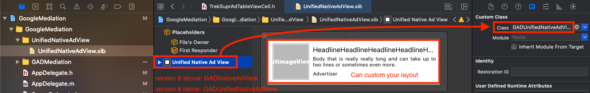
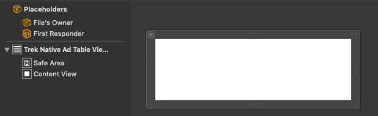
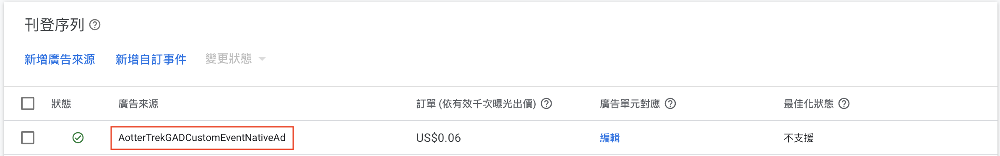
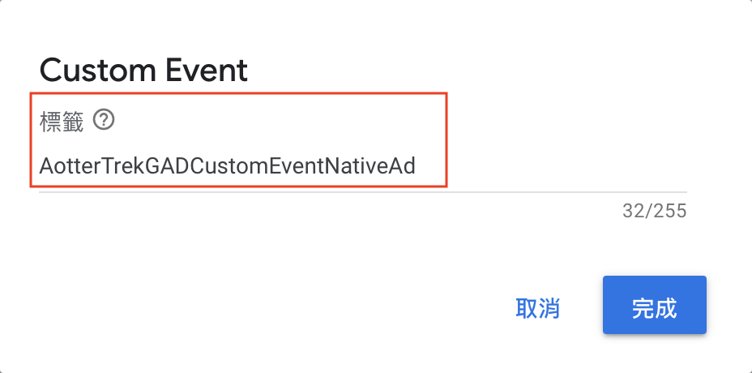

# Native Ad

Follow these steps to build a native ad layout that fits your application and then requests it.

Step 1: [Initialize AotterTrek SDK](native-ad.md#step-1-initialize-aottertrek-sdk) \
Step 2: [Customize _TableViewCell_ / _CollectionViewCell_ / _ViewController_](native-ad.md#step-2-customize-tableviewcell-collectionviewcell-viewcontroller)__

### Step 1: Initialize AotterTrek SDK&#x20;

_File: AppDelegate.m_

```swift
/// Need to import Lib
#import <AotterTrek-iOS-SDK/AotterTrek-iOS-SDK.h>
#import <GoogleMobileAds/GoogleMobileAds.h>
.
.
.

- (BOOL)application:(UIApplication *)application didFinishLaunchingWithOptions:(NSDictionary *)launchOptions {
    // Override point for customization after application launch.
    
    [[GADMobileAds sharedInstance] startWithCompletionHandler:nil];
    
    [[AotterTrek sharedAPI] initTrekServiceWithClientId:@"Your Client ID"
                                                   secret:@"Your Client Secret"];
    
    // Open Log
    //[[AotterTrek sharedAPI] performSelector:@selector(enableLoggerLevelDevDetail)];
    
    return YES;
}
```

### Step 2: Customize TableViewCell / CollectionViewCell / ViewController

Here we customize **TableViewCell** : `TrekNativeAdTableViewCell`


**Note:** **View Class** depends on the GoogleMobileAds SDK version\
GoogleMobileAds SDK version 8 and above: `GADNativeAdView`&#x20;




**- TrekNativeAdTableViewCell**



\- **GoogleMobileAds SDK version 8 and above**

```swift
#import <UIKit/UIKit.h>
#import <AotterTrek-iOS-SDK/AotterTrek-iOS-SDK.h>
#import <GoogleMobileAds/GoogleMobileAds.h>
#import <SDWebImage/SDWebImage.h>

NS_ASSUME_NONNULL_BEGIN

@interface TrekNativeAdTableViewCell : UITableViewCell
@property(nonatomic, strong) GADNativeAdView *nativeAdView; 

- (void)setGADNativeAdData:(GADNativeAd *)nativeAd;

@end

NS_ASSUME_NONNULL_END
```



### Declare data method

#### - **GoogleMobileAds SDK version 8 and above** <a href="#declare-a-gadunifiednativead-data-method" id="declare-a-gadunifiednativead-data-method"></a>

```swift
// Google Mediation NativeAd

- (void)setGADNativeAdData:(GADNativeAd *)nativeAd {
    
    NSArray *nibObjects =
    [[NSBundle mainBundle] loadNibNamed:@"UnifiedNativeAdView" owner:nil options:nil];
    [self setAdView:[nibObjects firstObject]];
    
    //NSString *img_icon = nativeAd.extraAssets[kTKAdImage_iconKey];//82x82
    //NSString *img_icon_hd = nativeAd.extraAssets[kTKAdImage_icon_hdKey];//300x300
    //NSString *img_main = nativeAd.extraAssets[kTKAdImage_mainKey];//1200x628
    //NSString *sponser = nativeAd.extraAssets[kTKAdSponser];
    
    ((UIImageView *)self.nativeAdView.iconView).image = nativeAd.icon.image;
    ((UILabel *)self.nativeAdView.headlineView).text = nativeAd.headline;
    ((UILabel *)self.nativeAdView.bodyView).text = nativeAd.body;
    ((UILabel *)self.nativeAdView.advertiserView).text = nativeAd.advertiser;
    self.nativeAdView.nativeAd = nativeAd;

    [self addSubview:self.nativeAdView];
}

// Common Method
- (void)setAdView:(GADUnifiedNativeAdView *)view {
    // Remove previous ad view.
    [self.nativeAdView removeFromSuperview];
    self.nativeAdView = view;

    // Add new ad view and set constraints to fill its container.
    [self addSubview:view];
    [self.nativeAdView setTranslatesAutoresizingMaskIntoConstraints:NO];

    NSDictionary *viewDictionary = NSDictionaryOfVariableBindings(_nativeAdView);
    [self addConstraints:[NSLayoutConstraint constraintsWithVisualFormat:@"H:|[_nativeAdView]|"
      options:0
      metrics:nil
      views:viewDictionary]];
    [self addConstraints:[NSLayoutConstraint constraintsWithVisualFormat:@"V:|[_nativeAdView]|"
      options:0
      metrics:nil
      views:viewDictionary]];
}
```







\- **YourViewController**



Rendering the ad view process:

#### **- GoogleMobileAds SDK version 8 and above**

```objectivec
// Define the display position of the ad in the TableView
static NSInteger googleMediationNativeAdPosition = 6;
.
.
.
@interface YourViewController ()<GADNativeAdLoaderDelegate, UITableViewDataSource, UITableViewDelegate> {

    GADNativeAd *_gADUnifiedNativeAd; 

}
@property UIRefreshControl *refreshControl;
@property (atomic, strong) GADAdLoader *adLoader;
@property (weak, nonatomic) IBOutlet UITableView *nativeAdTableView;

@end

@implementation YourViewController

- (void)viewDidLoad {
    [super viewDidLoad];
  
    [self setupTableVie];
    [self setupRefreshControl];
    [self setupGADAdLoader];
}

#pragma mark : Setup TableView

- (void)setupTableVie {
    self.nativeAdTableView.dataSource = self;
    self.nativeAdTableView.delegate = self;
    
    [self.nativeAdTableView registerClass:UITableViewCell.class forCellReuseIdentifier:@"Cell"];
    [self.nativeAdTableView registerNib:[UINib nibWithNibName:@"TrekNativeAdTableViewCell" bundle:nil] forCellReuseIdentifier:@"TrekNativeAdTableViewCell"];
}

- (void)setupRefreshControl {
    self.refreshControl = [[UIRefreshControl alloc]init];
    
    [self.refreshControl addTarget:self action:@selector(onRefreshTable) forControlEvents:UIControlEventValueChanged];
    [self.nativeAdTableView addSubview:self.refreshControl];
}

#pragma mark : Setup GADAdLoader

- (void)setupGADAdLoader {
                                             
    self.adLoader = [[GADAdLoader alloc]initWithAdUnitID: @"<Your adUnit Id>"
                                      rootViewController: self
                                                 adTypes: @[kGADAdLoaderAdTypeNative]
                                                 options: @[]];
    
    self.adLoader.delegate = self;

    [self adLoaderLoadRequest];
}

- (void)adLoaderLoadRequest {
    GADRequest *request = [GADRequest request];
    GADCustomEventExtras *extra = [[GADCustomEventExtras alloc] init];
    // FIll in categories like "news"、"movie" at CATEGORIES
    [extra setExtras:@{@"category":@"CATEGORIES"} forLabel:@"AotterTrekGADCustomEventNativeAd"];
    [request registerAdNetworkExtras:extra];
}

#pragma mark - Action

- (void)onRefreshTable {
    [self.refreshControl beginRefreshing];
    
    if (_gADUnifiedNativeAd) {
        _gADUnifiedNativeAd = nil;
    }
    
    [self adLoaderLoadRequest];
    [self.refreshControl endRefreshing];
}

#pragma mark - UITableViewDataSource

- (NSInteger)numberOfSectionsInTableView:(UITableView *)tableView {
    return 1;
}

- (NSInteger)tableView:(UITableView *)tableView numberOfRowsInSection:(NSInteger)section {
    return 30;
}

- (UITableViewCell *)tableView:(UITableView *)tableView cellForRowAtIndexPath:(NSIndexPath *)indexPath {
    
    if (indexPath.row == googleMediationNativeAdPosition) {
        if (_gADUnifiedNativeAd != nil) {
            TrekNativeAdTableViewCell *trekNativeAdTableViewCell = [tableView dequeueReusableCellWithIdentifier:@"TrekNativeAdTableViewCell" forIndexPath:indexPath];
            
            [trekNativeAdTableViewCell setGADNativeAdData:_gADUnifiedNativeAd];
            return trekNativeAdTableViewCell;
        }
    }
    
    UITableViewCell *cell = [tableView dequeueReusableCellWithIdentifier:@"Cell" forIndexPath:indexPath];
    cell.textLabel.text = [[NSString alloc]initWithFormat:@"index:%ld",(long)indexPath.row];
    return  cell;
}

#pragma mark - UITableViewDelegate

- (CGFloat)tableView:(UITableView *)tableView heightForRowAtIndexPath:(NSIndexPath *)indexPath {

    if (indexPath.row == googleMediationNativeAdPosition) {
        return _gADUnifiedNativeAd == nil ? 0:80;
    }
  
    return 80;
}


#pragma mark - GADNativeAdLoaderDelegate

- (void)adLoader:(GADAdLoader *)adLoader didReceiveNativeAd:(GADNativeAd *)nativeAd {
    // Delegate 回來的 nativeAd 已經可以接取到自己的 Custom Ad View，
    // 這部分可以將 nativeAd 放到 CustomTableViewCell 去接資料

    if (nativeAd != nil) {

        if ([[nativeAd.extraAssets allKeys]containsObject:@"trekAd"]) {
            NSString *adType = nativeAd.extraAssets[@"trekAd"];

            if ([adType isEqualToString:@"nativeAd"]) {
                _gADUnifiedNativeAd = nativeAd;
            }
        }
    }

    [self.nativeAdTableView reloadData];
}

- (void)adLoader:(GADAdLoader *)adLoader didFailToReceiveAdWithError:(NSError *)error {
    NSLog(@"Error Message:%@",error.description);
}


@end
```


Note: In`YourViewController.m` - `adLoaderLoadRequest`\
When requesting ads, the label parameter should be corresponding to the label set in the AdMob dashboard.







