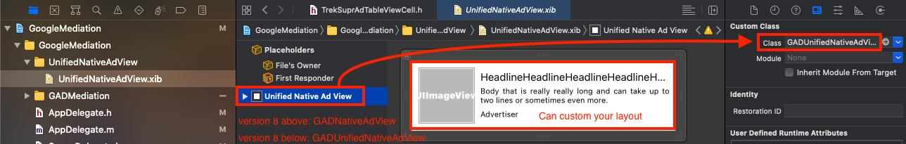

# Supr.Ad

Follow these steps to build a Supr.Ad layout and then requests it.

Step 1: [Initialize AotterTrek SDK ](supr.ad.md#step-1-initialize-aottertrek-sdk)\
Step 2: [Customize _TableViewCell_ / _CollectionViewCell_ / _ViewController_](supr.ad.md#step-2-customize-tableviewcell-collectionviewcell-viewcontroller)__


Notice: If your project is based on Swift, please import _Aotter-iOS-SDK.h_ in the bridge file.


```swift
#import <AotterTrek-iOS-SDK/AotterTrek-iOS-SDK.h>
```

### Step 1: Initialize AotterTrek SDK&#x20;

_File: AppDelegate.m_

```swift
/// Need to import Lib
#import <AotterTrek-iOS-SDK/AotterTrek-iOS-SDK.h>
#import <GoogleMobileAds/GoogleMobileAds.h>
.
.
.

- (BOOL)application:(UIApplication *)application didFinishLaunchingWithOptions:(NSDictionary *)launchOptions {
    // Override point for customization after application launch.
    
    [[GADMobileAds sharedInstance] startWithCompletionHandler:nil];
    
    [[AotterTrek sharedAPI] initTrekServiceWithClientId:@"Your Client ID"
                                                   secret:@"Your Client Secret"];
    
    // Open Log
    //[[AotterTrek sharedAPI] performSelector:@selector(enableLoggerLevelDevDetail)];
    
    return YES;
}
```

### Step 2: Customize TableViewCell / CollectionViewCell / ViewController

Here we customize **TableViewCell** : `TrekNativeAdTableViewCell`


**Note:** **View Class** depends on the GoogleMobileAds SDK version\
GoogleMobileAds SDK version 8 and above: `GADNativeAdView`&#x20;




**- TrekNativeAdTableViewCell**



\- **GoogleMobileAds SDK version 8 and above**

```swift
#import <UIKit/UIKit.h>
#import <AotterTrek-iOS-SDK/AotterTrek-iOS-SDK.h>
#import <GoogleMobileAds/GoogleMobileAds.h>
#import <SDWebImage/SDWebImage.h>

NS_ASSUME_NONNULL_BEGIN

@interface TrekNativeAdTableViewCell : UITableViewCell
@property(nonatomic, strong) GADNativeAdView *nativeAdView; 

- (void)setGADNativeAdData:(GADNativeAd *)nativeAd withViewSize:(CGSize)size;

@end

NS_ASSUME_NONNULL_END
```



### Declare data method

#### - **GoogleMobileAds SDK version 8 and above** <a href="#declare-a-gadunifiednativead-data-method" id="declare-a-gadunifiednativead-data-method"></a>

```swift
- (void)setGADNativeAdData:(GADNativeAd *)nativeAd withViewSize:(CGSize)size {
    
    for (UIView *subView in self.contentView.subviews) {
        [subView removeFromSuperview];
    }

    CGRect rect = CGRectMake(0, 0, size.width, size.height);
    GADMediaView *gADMediaView = [[GADMediaView alloc]initWithFrame:rect];
    gADMediaView.mediaContent = nativeAd.mediaContent;
    [self.contentView addSubview:gADMediaView];

    [gADMediaView setTranslatesAutoresizingMaskIntoConstraints:NO];

    [gADMediaView setTranslatesAutoresizingMaskIntoConstraints:NO];
    [gADMediaView.leadingAnchor constraintEqualToAnchor:self.contentView.leadingAnchor].active = YES;
    [gADMediaView.trailingAnchor constraintEqualToAnchor:self.contentView.trailingAnchor].active = YES;
    [gADMediaView.topAnchor constraintEqualToAnchor:self.contentView.topAnchor].active = YES;
    [gADMediaView.bottomAnchor constraintEqualToAnchor:self.contentView.bottomAnchor].active = YES;
}
```







\- **YourViewController**



#### **- GoogleMobileAds SDK version 8 and above**

```swift
// Define the display position of the ad in the TableView
static NSInteger googleMediationSuprAdPosition = 8;
.
.
.
@interface SuprAdViewController ()<GADNativeAdLoaderDelegate, UITableViewDataSource, UITableViewDelegate> {
    
    GADNativeAd *_gADUnifiedSuprAd;
    UIView *_suprAdView;
}

@property UIRefreshControl *refreshControl;
@property (atomic, strong) GADAdLoader *adLoader;
@property (weak, nonatomic) IBOutlet UITableView *suprAdTableView;

@end

@implementation YourViewController

- (void)viewDidLoad {
    [super viewDidLoad];
  
    [self setupTableVie];
    [self setupRefreshControl];
    [self setupGADAdLoader];
}

#pragma mark : Setup TableView

- (void)setupTableVie {
    self.suprAdTableView.dataSource = self;
    self.suprAdTableView.delegate = self;
    
    
    [self.suprAdTableView registerClass:UITableViewCell.class forCellReuseIdentifier:@"Cell"];
    
    [self.suprAdTableView registerNib:[UINib nibWithNibName:@"TrekSuprAdTableViewCell" bundle:nil] forCellReuseIdentifier:@"TrekSuprAdTableViewCell"];
}

- (void)setupRefreshControl {
    self.refreshControl = [[UIRefreshControl alloc]init];
    
    [self.refreshControl addTarget:self action:@selector(onRefreshTable) forControlEvents:UIControlEventValueChanged];
    [self.suprAdTableView addSubview:self.refreshControl];
}

#pragma mark : Setup GADAdLoader

- (void)setupGADAdLoader {
    
    // GoogleMobileAds version 8 above
    self.adLoader = [[GADAdLoader alloc]initWithAdUnitID: @"<Your adUnit Id>"
                                      rootViewController: self
                                                 adTypes: @[kGADAdLoaderAdTypeNative]
                                                 options: @[]];
    
    self.adLoader.delegate = self;

    [self adLoaderLoadRequest];
}

- (void)adLoaderLoadRequest {
    GADRequest *request = [GADRequest request];
    GADCustomEventExtras *extra = [[GADCustomEventExtras alloc] init];
    // FIll in categories like "news"、"movie" at CATEGORIES
    [extra setExtras:@{@"category":@"CATEGORIES"} forLabel:@"AotterTrekGADCustomEventNativeAd"];
    [request registerAdNetworkExtras:extra];
}

#pragma mark - UITableViewDataSource

- (NSInteger)numberOfSectionsInTableView:(UITableView *)tableView {
    return 1;
}

- (NSInteger)tableView:(UITableView *)tableView numberOfRowsInSection:(NSInteger)section {
    return 30;
}

- (UITableViewCell *)tableView:(UITableView *)tableView cellForRowAtIndexPath:(NSIndexPath *)indexPath {
    if (indexPath.row == googleMediationSuprAdPosition) {
        if(_gADUnifiedSuprAd != nil) {
            TrekSuprAdTableViewCell *trekSuprAdTableViewCell = [tableView dequeueReusableCellWithIdentifier:@"TrekSuprAdTableViewCell" forIndexPath:indexPath];
            
            if ([[_gADUnifiedSuprAd.extraAssets allKeys]containsObject:@"adSizeWidth"] &&
                [[_gADUnifiedSuprAd.extraAssets allKeys]containsObject:@"adSizeHeight"]) {
                
                // get ad prefered AdSize
                NSString *width = _gADUnifiedSuprAd.extraAssets[@"adSizeWidth"];
                NSString *height = _gADUnifiedSuprAd.extraAssets[@"adSizeHeight"];
                double adSizeWidth = [width doubleValue];
                double adSizeHeight = [height doubleValue];

                CGFloat viewWidth = UIScreen.mainScreen.bounds.size.width;
                CGFloat viewHeight = viewWidth * adSizeHeight/adSizeWidth;
                int adheight = (int)viewHeight;
                CGSize preferedMediaViewSize = CGSizeMake(viewWidth, adheight);
                
                [trekSuprAdTableViewCell setGADNativeAdData:_gADUnifiedSuprAd withViewSize:preferedMediaViewSize];
            }
            
            return trekSuprAdTableViewCell;
        }
    }
    
    
    UITableViewCell *cell = [tableView dequeueReusableCellWithIdentifier:@"Cell" forIndexPath:indexPath];
    cell.textLabel.text = [[NSString alloc]initWithFormat:@"index:%ld",(long)indexPath.row];
    return  cell;
}

#pragma mark - UITableViewDelegate

- (CGFloat)tableView:(UITableView *)tableView heightForRowAtIndexPath:(NSIndexPath *)indexPath {

    if (indexPath.row == googleMediationSuprAdPosition) {
        if ([[_gADUnifiedSuprAd.extraAssets allKeys]containsObject:@"adSizeWidth"] &&
            [[_gADUnifiedSuprAd.extraAssets allKeys]containsObject:@"adSizeHeight"]) {
            
            // get ad prefered AdSize
            NSString *width = _gADUnifiedSuprAd.extraAssets[@"adSizeWidth"];
            NSString *height = _gADUnifiedSuprAd.extraAssets[@"adSizeHeight"];
            double adSizeWidth = [width doubleValue];
            double adSizeHeight = [height doubleValue];

            CGFloat viewWidth = UIScreen.mainScreen.bounds.size.width;
            CGFloat viewHeight = viewWidth * adSizeHeight/adSizeWidth;
            
            return _gADUnifiedSuprAd == nil ? 0:viewHeight;
        }
    }
    
    return 80;
}

// Supr.Ad need to be notified when the ad view is scrolled, 
// you should always add this method:
#pragma mark : ScrlloView delegate

- (void)scrollViewDidScroll:(UIScrollView *)scrollView {
    if (_gADUnifiedSuprAd != nil) {
        [[NSNotificationCenter defaultCenter]postNotificationName:@"SuprAdScrolled"
                                                           object:self
                                                         userInfo:nil];
    }
}


#pragma mark - GADNativeAdLoaderDelegate

- (void)adLoader:(GADAdLoader *)adLoader didReceiveNativeAd:(GADNativeAd *)nativeAd {

    // Delegated nativeAd are able to receive its Custom Ad View，
    // This part can put nativeAd into CustomTableViewCell to get data.

    if (nativeAd != nil) {

        if ([[nativeAd.extraAssets allKeys]containsObject:@"trekAd"]) {
            NSString *adType = nativeAd.extraAssets[@"trekAd"];

            if ([adType isEqualToString:@"suprAd"]) {
                _gADUnifiedSuprAd = nativeAd;
            }
        }
    }

    [self.suprAdTableView reloadData];
}

- (void)adLoader:(GADAdLoader *)adLoader didFailToReceiveAdWithError:(NSError *)error {
    NSLog(@"Error Message:%@",error.description);
}


@end
```


Note: In`YourViewController.m` - `adLoaderLoadRequest`\
When requesting ads, the label parameter should be corresponding to the label set in the AdMob dashboard.






### Special Cases

There are some special cases when implementing Supr.Ad in your app. \
Please read the section [Special Cases](../../ad-formats/supr.ad.md#special-cases)

