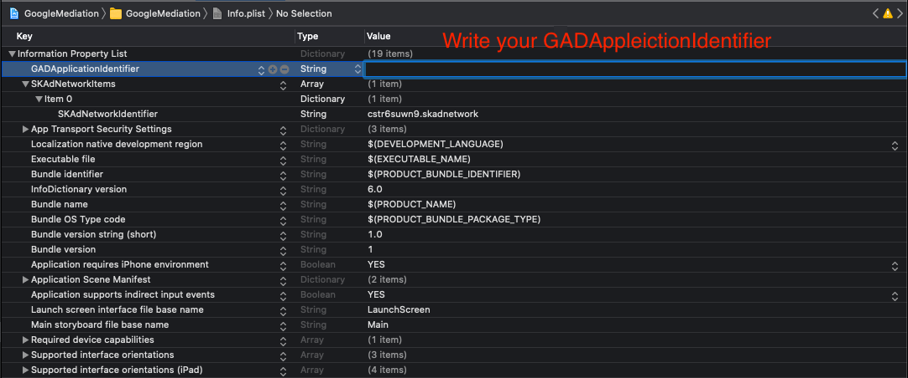
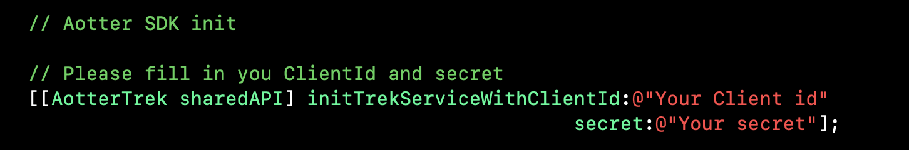

# Demo

### Trek AdMob Example App Demo

| **Google Mobile Ads SDK version**    | Download Link                                                                  |                                                                                            |
| ------------------------------------ | ------------------------------------------------------------------------------ | ------------------------------------------------------------------------------------------ |
| Google Ads SDK **version 8 above** ⇧ | [Sample Project](https://github.com/aotter/trek-ios-AdMobMediation\_v8-sample) | [README](https://github.com/aotter/trek-ios-AdMobMediation\_v8-sample/blob/main/README.md) |

What you need to do with this demo is to configure** **_**GADApplicationIdentifier**_, _**Ad Unit,**_ and _**Client Info**_ in the projects.

* **GADApplicationIdentifier **(_File: Info.plist_)

* **AdMob Ad Unit**

* **Client Info **(_File: AppDelegate.m_)

