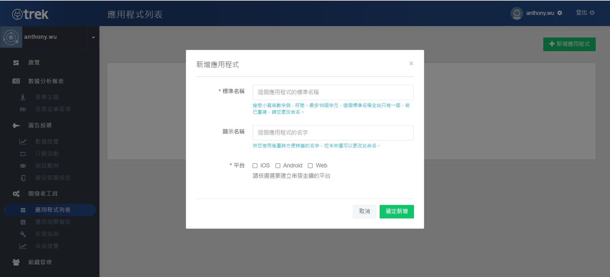

# Prerequisites

## Before you begin 

To prepare your app, complete the steps in the following sections.&#x20;

**Step 0 :** [**Check SDK Version Requirements**](prerequisites.md#step-0-check-sdk-version-requirements)****

**Step 1 :** [**Register AotterTrek Account**](prerequisites.md#step-1-register-aottertrek-account)****

**Step 2 :** [**Set Up New Application**](prerequisites.md#step-2-set-up-new-application)****

**Step 3 :** [**Create an Ad place**](prerequisites.md#step-3-create-an-ad-place)****

****

### ****[**Step 0 : Check SDK Version R**equirements](broken-reference)

Noticed the AotterTrek SDK version requirements is **iOS 9.0 and later**

### ****[**Step 1 : Register AotterTrek Account**](broken-reference)****

Register for AotterTrek Account **** [**here**](https://trek.aotter.net)**.**

### ****[**Step 2 : Set up New Application**](broken-reference)****

Set up a new application in the application list.

 

<figure><figcaption>
New application step 2
</figcaption></figure>

After entering the list, you might find the ad status is test ad only. For the publisher who use AotterTrek SDK for the first time and didn't get full access to ad slots management, please contact Aseal representative or [**E-mail us**](https://aseal.in/contactus).


**When activated, there will be ad slot management in the right column as shown.**


### ****[**Step 3 : Create an Ad place**](prerequisites.md#before\_you\_begin)****

Entering the ad slots management and then creating ad place. Name the ad place with lowercase letters **`a-z`** , number **`0-9`** and underscore **`_`** .\
AotterTrek currently provides three types of ad and different sizes:

* **Native Ad**
* **Supr.Ad (1200x628)**
* **Banner Ad (320x50)**

After the ad place is created, you will see a list of ad place as shown.

## Next Steps

* Follow our guides for installation SDK


[installation.md](../../sdk-integration/installation.md)


