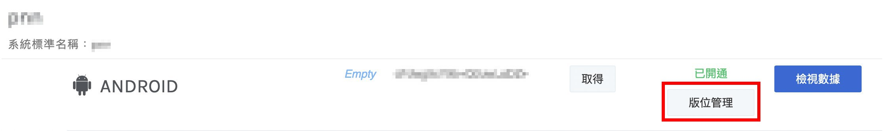
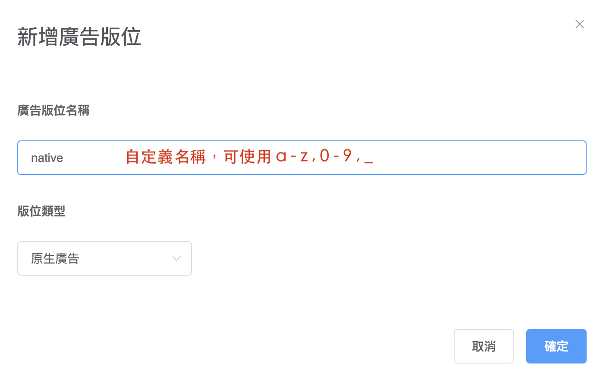
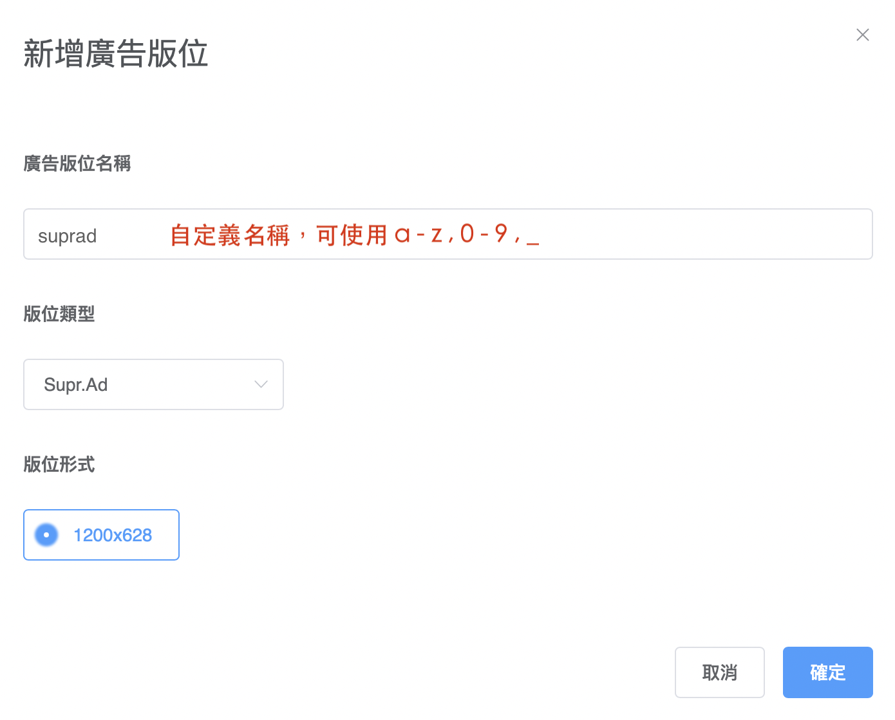

# Ad Formats

We provide **three different kinds of ad**. Checkout the following tabs for more infomation.


🧙🏼‍♂️ Tips: You need to build a ad unit in AotterTrek UI console. Enter app list and manage ad-slot, choose an ad type and size.




## Banner Ad <a href="#banner-ad" id="banner-ad"></a>

### 1. Create Ad slot <a href="#jian-li-ban-wei" id="jian-li-ban-wei"></a>

Enter the slot management of [Application List](https://trek.aotter.net/publisher/list/app) , create slot name and choose a type.




### Example APP form [Aotter GitHub](https://github.com/aotter/AotterTrek-Android-SDK/blob/master/android-sample/app/src/main/java/com/aotter/net/treksampleapp/activity/BannerAdListViewActivity.java)  <a href="#github-fan-li-app" id="github-fan-li-app"></a>

```java
@BindView(R.id.listview)
ListView mListView;

@BindView(R.id.ad_banner)
TKMediaView mTkMediaView;

@BindView(R.id.ad_content_layout)
LinearLayout mAd_content_layout;

private TKAdN tkAdN;

// "banner" is custom payload place name
//  place name will show on Trek Consloe , please define it.
//  tkAdN = new TKAdN(this, "banner", "NATIVE"); if don't have category, you can without it.
tkAdN = new TKAdN(this, "banner", "category_name", "SUPR_AD");
tkAdN.setAdListener(new TKAdListener() {

  @Override
  public void onAdLoaded(TKAdNative nativeAd) {
    ...
  }

  @Override
  public void onAdError(TKError tkError) {
    ...
  }

  @Override
  public void onAdClicked(TKAdNative nativeAd) {
    ...
  }

  @Override
  public void onAdImpression(TKAdNative nativeAd) {
    ...
  }
});
```

```java
@Override
public void onAdLoaded(TKAdNative nativeAd) {

    tkAdN.registerAdView(activity, mAd_content_layout, mTkMediaView, nativeAd);
}
```

## Lifecycle <a href="#lifecycle" id="lifecycle"></a>

```java
@Override
public void onPause() {
  super.onPause();

  if (tkAdN != null) {
    tkAdN.pause();
  }
}

@Override
public void onResume() {
  super.onResume();

  if (tkAdN != null) {
    tkAdN.resume();
  }
}


@Override
public void onDestroy() {
  super.onDestroy();

  if (tkAdN != null) {
    tkAdN.destroy();
  }
}
```

#### isExpired <a href="#isexpired" id="isexpired"></a>

Check the ad is expired or not.

```java
nativeAd.isExpired();
```



## Native Ad <a href="#native-ad" id="native-ad"></a>

### Create Ad slot <a href="#jian-li-ban-wei" id="jian-li-ban-wei"></a>

Enter the slot management of [Application List](https://trek.aotter.net/publisher/list/app) , create slot name and choose a type.




測試key->名稱"banner" / "supr\_Ad" / "native"

正式key -> 名稱要換成自己建造的版位名稱


### Sample Code&#x20;

```java
@Bind(R.id.native_ad_container)
LinearLayout mNative_ad_container;

@Bind(R.id.native_ad_title)
TextView mNative_ad_title;

@Bind(R.id.native_ad_body)
TextView mNative_ad_body;

private TKAdN tkAdN;

// "native" is custom payload place name
//  place name will show on Trek Consloe , please define it.
//  tkAdN = new TKAdN(this, "native", "NATIVE"); if don't have category, you can without it.
tkAdN = new TKAdN(this, "native", "category_name", "NATIVE");
tkAdN.setAdListener(new TKAdListener() {

  @Override
  public void onAdLoaded(TKAdNative nativeAd) {
    ...
  }

  @Override
  public void onAdError(TKError tkError) {
    ...
  }

  @Override
  public void onAdClicked(TKAdNative nativeAd) {
    ...
  }

  @Override
  public void onAdImpression(TKAdNative nativeAd) {
    ...
  }
});
```

```java
@Override
public void onAdLoaded(TKAdNative nativeAd) {

  String adTitle = nativeAd.getAdTitle();
  String adText = nativeAd.getAdText();
  String adActionText = nativeAd.getActionText();
  String adSponser = nativeAd.getAdSponsor();
  String adVertiserName = nativeAd.getAdAdvertiserName();
  String adimg_icon_url = nativeAd.getAdImgIcon(); //82x82
  String adimg_icon_hd_url = nativeAd.getAdImgIconHd(); //300x300
  String adimg_main_url = nativeAd.getAdImgMain(); //1200x627

  mNative_ad_title.setText(adTitle);
  mNative_ad_body.setText(adText);

  tkAdN.registerAdView(activity, mNative_ad_container, nativeAd);
}
```

## [Lifecycle](https://aotter.github.io/trek-sdk-docs/#/Android/Native\_Ad?id=lifecycle) <a href="#lifecycle" id="lifecycle"></a>

```java
@Override
public void onPause() {
  super.onPause();

  if (tkAdN != null) {
    tkAdN.pause();
  }
}

@Override
public void onResume() {
  super.onResume();

  if (tkAdN != null) {
    tkAdN.resume();
  }
}


@Override
public void onDestroy() {
  super.onDestroy();

  if (tkAdN != null) {
    tkAdN.destroy();
  }
}
```

#### isExpired <a href="#isexpired" id="isexpired"></a>

Check the ad is expired or not.

```java
nativeAd.isExpired();
```



## Supr.Ad <a href="#supr-ad" id="supr-ad"></a>

### Create Ad slot <a href="#jian-li-ban-wei" id="jian-li-ban-wei"></a>

Enter the slot management of [Application List](https://trek.aotter.net/publisher/list/app) , create slot name and choose a type.




### Simple Code

```markup
<LinearLayout
    android:id="@+id/ad_container"
    android:layout_width="wrap_content"
    android:layout_height="wrap_content"
    android:orientation="vertical"
    android:padding="10dp">

    <com.aotter.net.trek.ads.view.TKMediaView
        android:id="@+id/ad_view"
        android:layout_width="wrap_content"
        android:layout_height="wrap_content"
    />
</LinearLayout>
```

```java
@Bind(R.id.ad_container)
LinearLayout mAdContainer;

@BindView(R.id.ad_view)
TKMediaView mTKMediaView;

private TKAdN tkAdN;

// "suprad" is custom payload place name
//  place name will show on Trek Consloe , please define it.
//  tkAdN = new TKAdN(this, "suprad", "SUPR_AD"); if don't have category, you can without it.
tkAdN = new TKAdN(this, "suprad", "category_name", "SUPR_AD");
tkAdN.setAdListener(new TKAdListener() {

  @Override
  public void onAdLoaded(TKAdNative nativeAd) {
    ...
  }

  @Override
  public void onAdError(TKError tkError) {
    ...
  }

  @Override
  public void onAdClicked(TKAdNative nativeAd) {
    ...
  }

  @Override
  public void onAdImpression(TKAdNative nativeAd) {
    ...
  }
});
```

```java
@Override
public void onAdLoaded(NativeAd nativeAd) {
  ...

  tkAdN.registerAdView(activity, mAdContainer, mTKMediaView, nativeAd);
}
```

## Lifecycle <a href="#lifecycle" id="lifecycle"></a>

```java
@Override
public void onPause() {
  super.onPause();

  if (tkAdN != null) {
    tkAdN.pause();
  }
}

@Override
public void onResume() {
  super.onResume();

  if (tkAdN != null) {
    tkAdN.resume();
  }
}


@Override
public void onDestroy() {
  super.onDestroy();

  if (tkAdN != null) {
    tkAdN.destroy();
  }
}
```

#### isExpired <a href="#isexpired" id="isexpired"></a>

Check the ad is expired or not.

```java
nativeAd.isExpired();
```

#### isVideoAd <a href="#isvideoad" id="isvideoad"></a>

Check the ad is video or not.

```java
nativeAd.isVideoAd();
```


