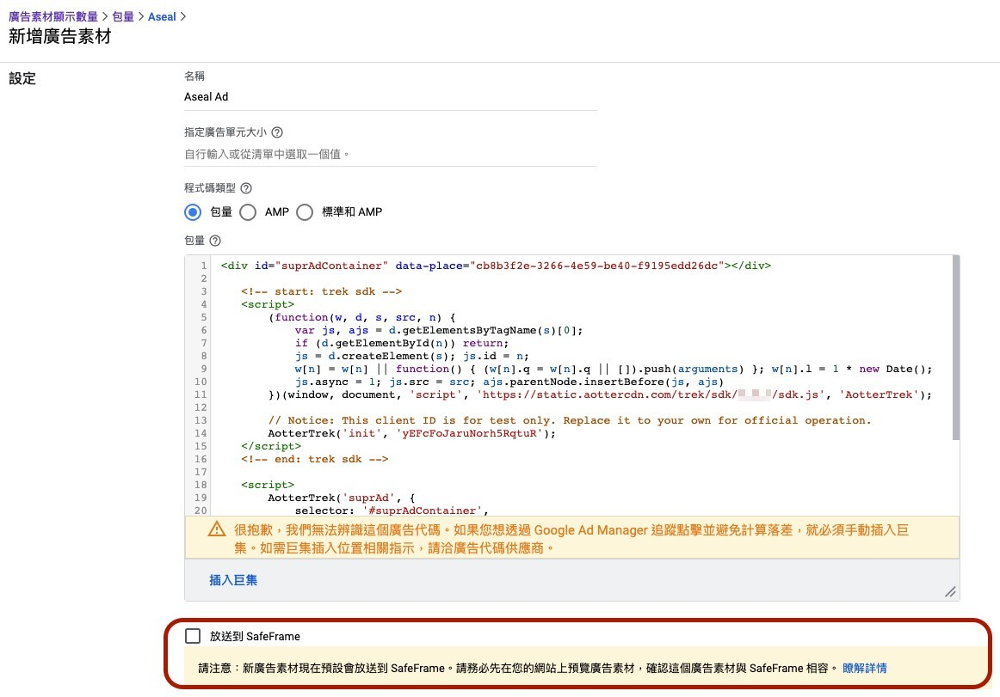

# Google Ad Manager Mediation

This section provides instructions on using Google Ad Manager for displaying AotterTrek ads. Please follow the steps below set your Google Ad Manager.

Step 1: [Add Creatives](google-ad-manager-mediation.md#step-1-add-creatives)\
Step 2: [Set Up Orders, Line Items](google-ad-manager-mediation.md#step-2-set-up-orders-line-items)\
Step 3: [Create Ad Unit and Generate Publisher Tag](google-ad-manager-mediation.md#step-3-create-ad-unit-and-generate-publisher-tag)

### Step 1: Add Creatives

1. Click "**ADD CREATIVES**" to add a new creative.&#x20;
2. Choose "**Third-Party**" section to use code from the third-party ad server.
3. Copy the code block below and paste it to the "Code snippet" in GAM.
4. Replace the `"placement_UUID"` with your own ad place UUID and use your **client ID** instead of the test client ID in the following code block.

### Example

<pre class="language-markup"><code class="lang-markup">&#x3C;div id="supr-ad-container">&#x3C;/div>
&#x3C;script>
  AotterTrekConfig = {
    // Notice: This client ID is for test only. Replace it with your own for official operation.
    clientId: 'yEFcFoJaruNorh5RqtuR',
    selector: '#supr-ad-container',
    place: 'placement_UUID',
    onAdLoad: () => {
       // Ad shows. Do something.
    },
    onAdFail: () => {
       // Ad fail. Do something.
    }
  }
  
<strong> !function(){"use strict";const e=window.top||window,t=e.document,n=document,o="TREK_SESSION",r="https://static.aottercdn.com/trek/sdk/3.5.1/sdk.js",c="web_3.5.1",i=n.createElement("link");n.getElementById("trek-catrun-preconnect")||(i.href="https://tkcatrun.aotter.net",i.rel="preconnect",n.head.insertAdjacentElement("beforeend",i));const s=n.createElement("link");n.getElementById("trek-sdk-preload")||(s.href=r,s.rel="preload",s.as="script",n.head.insertAdjacentElement("beforeend",s));const d=(e="")=>e?((Number(e)^16*Math.random())>>Number(e)/4).toString(16):"10000000-1000-4000-8000-100000000000".replace(/[018]/g,d),a=()=>(t.cookie.split(";").find((e=>e.includes(o)))||"").split("=")[1],l=()=>{const n=(()=>{const t=`__tk${Math.random()}`,n=new Date(0),o=e.location.hostname.split("."),r=[];for(r.unshift(o.pop());o.length;){r.unshift(o.pop());const e=r.join("."),c=`${t}=;domain=${e}`;if(document.cookie=c,document.cookie.includes(t))return document.cookie=`${c};expires=${n}`,e}})(),o=new Date((new Date).getTime()+94608e6).toUTCString();t.cookie=`TREK_SESSION=${d()};path=/;domain=${n};expires=${o}`},m=new Promise((e=>{let n=a();n||(l(),n=a());const o=encodeURIComponent(JSON.stringify({device:{webSessionId:n},fetchNumber:1,returnBlank:!1,user:{},payload:{place:AotterTrekConfig.place,meta:{dr:t.referrer,dt:t.title,dl:t.location.href}},sdkVersionCode:10,sdkVersion:c}));fetch(`https://r2d2.aotter.net/web/fetch?q=${o}`,{method:"GET",headers:{"x-aotter-clientid":AotterTrekConfig.clientId,"x-aotter-version":c},credentials:"include",mode:"cors"}).then((e=>e.json())).then((({success:t=[]})=>{e(t)})).catch((()=>{e([])}))})),k=new Promise((e=>{!function(t,n,o,r,c){let i,s=n.getElementsByTagName(o)[0];n.getElementById(c)||(i=n.createElement(o),i.id=c,t[c]=t[c]||function(){(t[c].q=t[c].q||[]).push(arguments)},t[c].l=1*new Date,i.async=1,i.src="https://static.aottercdn.com/trek/sdk/3.5.1/sdk.js",i.onload=()=>{e()},s.parentNode.insertBefore(i,s))}(window,document,"script",0,"AotterTrek")}));Promise.all([m,k]).then((([e])=>{AotterTrek("init",AotterTrekConfig.clientId),AotterTrek("suprAd",AotterTrekConfig,e),AotterTrek("send")}))}();
</strong>&#x3C;/script>
</code></pre>

### Example with Passback

```html
<div id="gpt-passback">
   <div id="supr-ad-containe"></div>
</div>
<script async src="https://securepubads.g.doubleclick.net/tag/js/gpt.js"></script>
<script>
  AotterTrekConfig = {
    // Notice: This client ID is for test only. Replace it with your own for official operation.
    clientId: 'yEFcFoJaruNorh5RqtuR',
    selector: '#supr-ad-container',
    place: 'placement_UUID',
    onAdLoad: () => {
       // Ad shows. Do something.
    },
    onAdFail: () => {
      window.googletag = window.googletag || {cmd: []};
         googletag.cmd.push(function() {
            googletag.defineSlot('slot_name', [[300, 250], [336, 280]], 'gpt-passback').addService(googletag.pubads());
            googletag.enableServices();
            googletag.display('gpt-passback');
         });
    }
  }
  
 !function(){"use strict";const e=window.top||window,t=e.document,n=document,o="TREK_SESSION",r="https://static.aottercdn.com/trek/sdk/3.5.1/sdk.js",c="web_3.5.1",i=n.createElement("link");n.getElementById("trek-catrun-preconnect")||(i.href="https://tkcatrun.aotter.net",i.rel="preconnect",n.head.insertAdjacentElement("beforeend",i));const s=n.createElement("link");n.getElementById("trek-sdk-preload")||(s.href=r,s.rel="preload",s.as="script",n.head.insertAdjacentElement("beforeend",s));const d=(e="")=>e?((Number(e)^16*Math.random())>>Number(e)/4).toString(16):"10000000-1000-4000-8000-100000000000".replace(/[018]/g,d),a=()=>(t.cookie.split(";").find((e=>e.includes(o)))||"").split("=")[1],l=()=>{const n=(()=>{const t=`__tk${Math.random()}`,n=new Date(0),o=e.location.hostname.split("."),r=[];for(r.unshift(o.pop());o.length;){r.unshift(o.pop());const e=r.join("."),c=`${t}=;domain=${e}`;if(document.cookie=c,document.cookie.includes(t))return document.cookie=`${c};expires=${n}`,e}})(),o=new Date((new Date).getTime()+94608e6).toUTCString();t.cookie=`TREK_SESSION=${d()};path=/;domain=${n};expires=${o}`},m=new Promise((e=>{let n=a();n||(l(),n=a());const o=encodeURIComponent(JSON.stringify({device:{webSessionId:n},fetchNumber:1,returnBlank:!1,user:{},payload:{place:AotterTrekConfig.place,meta:{dr:t.referrer,dt:t.title,dl:t.location.href}},sdkVersionCode:10,sdkVersion:c}));fetch(`https://r2d2.aotter.net/web/fetch?q=${o}`,{method:"GET",headers:{"x-aotter-clientid":AotterTrekConfig.clientId,"x-aotter-version":c},credentials:"include",mode:"cors"}).then((e=>e.json())).then((({success:t=[]})=>{e(t)})).catch((()=>{e([])}))})),k=new Promise((e=>{!function(t,n,o,r,c){let i,s=n.getElementsByTagName(o)[0];n.getElementById(c)||(i=n.createElement(o),i.id=c,t[c]=t[c]||function(){(t[c].q=t[c].q||[]).push(arguments)},t[c].l=1*new Date,i.async=1,i.src="https://static.aottercdn.com/trek/sdk/3.5.1/sdk.js",i.onload=()=>{e()},s.parentNode.insertBefore(i,s))}(window,document,"script",0,"AotterTrek")}));Promise.all([m,k]).then((([e])=>{AotterTrek("init",AotterTrekConfig.clientId),AotterTrek("suprAd",AotterTrekConfig,e),AotterTrek("send")}))}();
</script>
```


Please replace`placement_UUID`with your ad place UUID.


Please refer to the screenshot below and note that "**Serve into a SafeFrame**" is not supported currently. **Do not select the checkbox**.



### Step 2: Set Up Orders, Line Items

To run a new ad campaign through Google Ad Manager you have to create a new order, set up line items, add creatives, and approve the order to serve the ads.&#x20;

1. Click `Orders` tab on the left-side column in Google Ad Manager.
2. Click `New order` to create a new order.
3. Fill in the information.
4. Click `Create Line Items` the button below.
5. Fill in the line item name, which must be unique.
6. Enter the type of line item, size of the creates, dates, quantity, and cost.&#x20;
7. Select the inventory in which you would like to deliver ads. You can target ad units, placements, or both. ( If you set to serve as run-of-network, it means that the line item can serve to any ad unit on your website.)
8. After finishing the line item set, click `Save` to save it.

### Step 3: Create Ad Unit and Generate Publisher Tag

1. Create a new ad unit.
2. Set up name, size, and other items for the ad unit.
3. Enter the ad unit and click the Code tab on the top.
4. Choose Publish Tag and click continue.
5. Select tag options. (Make sure you check the "Enable single request" checkbox.)
6. Paste the code snippet into your website.&#x20;
